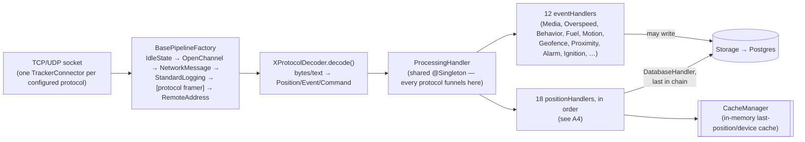

# Traccar server — architecture

Full architecture of how this server (`10.74.18.4`, this fork of Traccar)
runs, top to bottom — bootstrap, the protocol plugin system (~200 decoders,
of which this deployment enables exactly one), storage, the REST API and
permission model, the web frontend, and then (Part B) everything specific
to the Freematics packet path and this project's own additions. Written
2026-09-22, verified against actual code — see file:line references.
Companion doc: `firmware_v5/telelogger/ARCHITECTURE.md` (device side).

## Part A — the general platform

### A1. Bootstrap (`Main.java`, `MainModule.java`)

```
main(args)
  Locale.setDefault(ENGLISH)
  configFile = args[last] (e.g. conf/traccar.xml)
  run(configFile):
    injector = Guice.createInjector(
        new MainModule(configFile),   // Config, per-request/singleton bindings
        new DatabaseModule(),          // Storage → DatabaseStorage (JDBC/HikariCP)
        new WebModule())                // JAX-RS/Jetty wiring
    for clazz in [ScheduleManager, ServerManager, WebServer, BroadcastService]:
        injector.getInstance(clazz).start()     // each implements LifecycleObject
    Runtime.addShutdownHook(→ stop() each service in reverse, then
                               executorService.shutdown())
```
Everything in the process is a Guice-managed singleton reached through this
one injector (`Main.getInjector()`) — there is no separate "app context"
object; any class can `@Inject` `Config`, `Storage`, `CacheManager`, etc.

### A2. Protocol plugin system — how "~200 GPS protocols" actually works

```java
// ServerManager.java:47-64
for (Class<?> protocolClass : ClassScanner.findSubclasses(BaseProtocol.class, "org.traccar.protocol")) {
    String protocolName = BaseProtocol.nameFromClass(protocolClass);   // "Freematics" → "freematics"
    if (enabledProtocols == null || enabledProtocols.contains(protocolName)) {
        if (config.getInteger(Keys.PROTOCOL_PORT.withPrefix(protocolName)) > 0) {
            BaseProtocol protocol = injector.getInstance(protocolClass);
            connectorList.addAll(protocol.getConnectorList());   // → Netty TrackerConnector(s)
            protocolList.put(protocol.getName(), protocol);
        }
    }
}
```
`src/main/java/org/traccar/protocol/` has **one `*Protocol.java` +
`*ProtocolDecoder.java` pair per supported device brand/model** (~200
files) — this is a pure classpath-scan plugin pattern, not a registry
someone maintains by hand. **A protocol only actually starts listening if
its port is explicitly configured with a value > 0** in `traccar.xml`
(`<entry key='freematics.port'>6000</entry>`) — every other one of the
~200 is present on the classpath but dormant, costing nothing at runtime.
This is *why* picking a custom port matters (see the port-renumbering
project memory): `tk103.port` defaults to 5002, `gl200.port` to 5004, etc.
— reusing one of those defaults for something custom risks silently
colliding with a real device's factory port if that protocol is ever
enabled later.

Every decoder extends `BaseProtocolDecoder` and returns either a single
`Position`/`Event`/`Command` or a `Collection` of them from `decode()` —
`FreematicsProtocolDecoder` (Part B) is one ordinary instance of this same
pattern, nothing special about its wiring.

### A3. Ingest pipeline (per-connection Netty pipeline → the shared processing chain)


**Every protocol's decoded `Position` passes through the exact same shared
`ProcessingHandler`** — this is the architectural point that matters: none
of the 18 position handlers or 12 event handlers are protocol-specific,
they operate purely on the generic `Position`/`Device` model regardless of
which decoder produced the object.

### A4. The 18 position handlers, what each one actually does (generic)

| # | Handler | Purpose |
|---|---|---|
| 1 | `ComputedAttributesHandler.Early` | evaluates user-defined JS/expression attributes flagged "before" |
| 2 | `OutdatedHandler` | drops positions older than a configured threshold |
| 3 | `TimeHandler` | can override device/fix/server time per config (not used by this project) |
| 4 | `GeolocationHandler` | resolves position from cell-tower/WiFi data when no GPS fix (unused here — this device always has real GPS) |
| 5 | `HemisphereHandler` | fixes hemisphere sign errors some protocols are known to get wrong |
| 6 | `MapMatcherHandler` | snaps position to nearest road (unused unless a map-matching provider is configured) |
| 7 | `DistanceHandler` | computes `KEY_DISTANCE`/`KEY_TOTAL_DISTANCE` from the **CacheManager-cached last position** — Part B §7 covers a real incident from this |
| 8 | `FilterHandler` | drops positions failing configured sanity filters (duplicate, invalid, far, static, …) |
| 9 | `GeofenceHandler` | matches `tc_geofences`, sets `position.geofenceIds` |
| 10 | `GeocoderHandler` | reverse-geocodes lat/lon → `address` |
| 11 | `SpeedLimitHandler` | attaches a road speed limit if a provider is configured |
| 12 | `MotionHandler` | derives `KEY_MOTION` (moving/stopped) — feeds trip/stop detection |
| 13 | `ComputedAttributesHandler.Late` | same as #1, "after" hook |
| 14 | `DriverHandler` | resolves an RFID/iButton read to a `tc_drivers` row |
| 15 | `CopyAttributesHandler` | copies configured attributes from the device's last position forward |
| 16 | `EngineHoursHandler` | accumulates `KEY_HOURS` from ignition state |
| 17 | `PositionForwardingHandler` | re-sends the position to a configured external webhook/forwarder |
| 18 | `DatabaseHandler` | `storage.addObject(position, …)` — **the actual INSERT**; also updates `tc_devices.positionId` |

After `DatabaseHandler`, `cacheManager.updatePosition(position)` refreshes
the in-memory cache handler #7 will read on the *next* position for this
device.

### A5. Storage layer (`storage/Storage.java`, `DatabaseStorage`)

```java
public abstract class Storage {
    <T> List<T>   getObjects(Class<T> clazz, Request request);
    <T> Stream<T> getObjectsStream(Class<T> clazz, Request request);
    <T> long      addObject(T entity, Request request);
    <T> void      updateObject(T entity, Request request);
    void          removeObject(Class<?> clazz, Request request);
    // + getPermissions/addPermission/removePermission
}
```
A generic, **reflection-based mini-ORM**, not hand-written SQL per entity —
`Request`/`Condition`/`Order`/`Columns` (from `storage.query.*`) build a
query against whatever table a `@Table`-ish-annotated model class maps to;
every REST resource and every internal handler goes through this same
abstraction (`DeviceResource`/`OdometerResource` in Part B use it
directly). Backed by `DatabaseModule` → JDBC (Postgres for this
deployment, HikariCP pooled) + Liquibase-managed schema (`schema/
changelog-*.xml`, applied automatically at boot — this is why a manual
schema-folder sync matters on deploy, see A8).

### A6. REST API + permissions (`api/` package)

```java
// api/BaseResource.java — every resource extends this
class BaseResource {
    @Context SecurityContext securityContext;   // session-cookie auth
    @Inject  Storage storage;
    @Inject  PermissionsService permissionsService;
    long getUserId() { … from the authenticated principal … }
}
```
A typical write endpoint (`OdometerResource`/`DeviceResource`, Part B):
`permissionsService.checkPermission(Device.class, getUserId(), deviceId)`
(is this user allowed to touch this device at all) then
`permissionsService.checkEdit(getUserId(), Device.class, admin, manager)`
(is this user's account itself read-only — the `UserRestriction.readonly`
flag distinguishing `ota@ultd.sk` from `assist@ultd.sk`, Part B §6) — both
checks are per-call, not cached, so a readonly account gets a clean 403
before any business logic runs (this is how a *quick* 400 vs 403 tells you
whether a failing write reached real logic or was rejected at the door —
used this session to rule out a permissions problem for the odometer bug).

### A7. Web server (`web/WebServer.java`, Jetty)

One Jetty instance serves **both** the REST API (`/api/*`, JAX-RS via
Jersey) **and** the static `traccar-web` production build (everything
else, SPA fallback to `index.html`) on the same port (`:8082` here) — there
is no separate static file server; `web/mapbox-gl-rtl-text.js` living
outside the normal Vite build output (Part B §9's deploy gotcha) is served
from this same static root.

### A8. traccar-web frontend (`traccar-web` repo)

```
src/
 ├─ store/          Redux Toolkit: session, devices, events, motion,
 │                   geofences, groups, drivers, maintenances, calendars
 ├─ map/             MapView + MapPositions/MapMarkers (maplibre-gl)
 ├─ main/            device list, EventsDrawer, top-level shell
 ├─ reports/         Trips/Stops/Summary/Chart/Logbook/BusinessAddresses/…
 │                   report pages — each POSTs to a matching
 │                   /api/reports/* Java endpoint
 ├─ settings/        Server/User/Device/Group/Geofence/… CRUD pages
 └─ common/
     ├─ util/formatter.js      value formatting (Part B §11)
     ├─ util/preferences.js    usePreference()/useAttributePreference()
     └─ attributes/            per-entity known-attribute lists (dropdowns
                                 in the generic "Attributes" editor)
```
State/preference precedence (`usePreference`/`useAttributePreference`):
`server.forceSettings` ? server wins over user : user wins over server —
either way falling through to a hardcoded default if neither has the key.
Deploy: `npx vite build` → static output served by A7's Jetty instance —
no separate Node server in production.

## Part B — this project's specific packet path &amp; additions

### B1. Process tree (this fork's server, `10.74.18.4`)

```
systemd: traccar.service                    (User=traccar, /opt/traccar → /home/traccar symlink)
 └─ java -jar tracker-server.jar conf/traccar.xml
     ├─ Guice injector boots all singletons (Config, CacheManager, …)
     ├─ per-protocol TrackerServer (Netty) — one per Keys.PROTOCOL_PORT
     │   entry actually configured in traccar.xml; for this project:
     │     freematics.port = 6000/udp   (device traffic)
     │     osmand.port     = 6002/tcp   (Traccar Android app)
     ├─ WebServer (Jetty) — REST API + static traccar-web build, :8082
     └─ freematics-ota (SEPARATE systemd unit, SEPARATE process,
         /opt/freematics-ota) — pull-OTA HTTPS server, :6001
```

`freematics-ota` is a standalone Python service (not part of the Java
process) — see §6.

## B2. One UDP packet → one DB row (Netty pipeline)

```
UDP datagram, port 6000
   ▼
BasePipelineFactory (per-protocol Netty pipeline)
   │  IdleStateHandler → OpenChannelHandler → NetworkMessageHandler →
   │  StandardLoggingHandler → [decoder-specific framer, none needed for
   │  this text protocol] → RemoteAddressHandler
   ▼
FreematicsProtocolDecoder.decode()               [protocol/FreematicsProtocolDecoder.java:216]
   │  splits on '#'/'*' → decodeEvent() (EV=... login/heartbeat) or
   │  decodePosition() (the "0:..." PID stream)
   │  decodePosition(): for each "key=value"/"key:value" pair, key=0x0
   │  starts a NEW Position + fresh DateBuilder(new Date()) — i.e. TODAY's
   │  date is the fallback UNLESS overridden by an 0x11 key in the packet.
   │    0x10 → dateBuilder.setTime(...)     (GPS time-of-day)
   │    0x11 → dateBuilder.setDateReverse(...) (GPS date, DDMMYY)
   │    0xA/0xB → lat/lon (sets position.valid=true)
   │    0x10c → KEY_RPM + KEY_IGNITION=(rpm>0)
   │    0x1a6 → KEY_ODOMETER (×1000, device sends whole km)
   │    default → PREFIX_IO + key   (raw io<N> attribute, unmapped PIDs)
   │  finalizePosition(): NEW 2026-09-22 safety net — if the built time is
   │  >5min in the future vs. server time, discard it and use server time
   │  instead (see §7).
   ▼
ProcessingHandler (Netty inbound handler, @Singleton)          [ProcessingHandler.java:101-119]
   positionHandlers, IN THIS EXACT ORDER:
     1. ComputedAttributesHandler.Early
     2. OutdatedHandler
     3. TimeHandler
     4. GeolocationHandler
     5. HemisphereHandler
     6. MapMatcherHandler
     7. DistanceHandler        ← computes KEY_DISTANCE + KEY_TOTAL_DISTANCE
                                  from CacheManager's cached last position
                                  for this device (see §7 — this is the
                                  in-memory-cache gotcha)
     8. FilterHandler
     9. GeofenceHandler        ← matches tc_geofences (NOT tc_business_
                                  addresses — those are a separate, unrelated
                                  mechanism, see §5)
    10. GeocoderHandler        ← reverse-geocode via Nominatim, persists
                                  address back to the position (this fork's
                                  own fix, resolveAndPersistAddress())
    11. SpeedLimitHandler
    12. MotionHandler
    13. ComputedAttributesHandler.Late
    14. DriverHandler
    15. CopyAttributesHandler
    16. EngineHoursHandler
    17. PositionForwardingHandler
    18. DatabaseHandler        ← storage.addObject(position, …) — THIS is
                                  the actual INSERT into tc_positions
   then eventHandlers (Media/CommandResult/Overspeed/Behavior/Fuel/Motion/
   Geofence/Proximity/Alarm/Ignition/Maintenance/Driver) — each may write
   tc_events rows off the now-persisted position.
   ▼
cacheManager.updatePosition(position)     — updates the IN-MEMORY cache
tc_devices.positionid = position.id       — via DatabaseHandler
```

## B3. Data model (this project's relevant tables; column types confirmed
from `schema/changelog-4.0-clean.xml` + `6.17.0.xml` — **note: this server
runs Postgres, and `attributes` columns are `character varying`, NOT
`jsonb`, on both `tc_devices` and `tc_servers` — never use jsonb `||`/
`jsonb_set` on them from raw SQL, always overwrite with a complete JSON
string, per the 2026-09-22 corruption incident**)

```
tc_devices
  id INT PK, name, uniqueid (="ZKUCA42T"), positionid INT, groupid,
  attributes VARCHAR(4000)   -- odometerAnchorReal/Distance/Time/Factor,
                              -- notificationTokens, twelveHourFormat (user-
                              -- level, not device), etc. — free-form JSON
                              -- text, app-interpreted, no DB-level schema

tc_positions
  id INT PK, protocol, deviceid FK, servertime (real receive time, set by
  the DB on insert), devicetime, fixtime (device-claimed time — this is
  the one that can be wrong, see §7), valid, latitude, longitude, altitude,
  speed, course, address, attributes VARCHAR  -- KEY_TOTAL_DISTANCE,
                                                -- KEY_ODOMETER, KEY_RPM,
                                                -- KEY_IGNITION, io<N>, …

tc_business_addresses      (this fork's own table, NOT upstream Traccar)
  id BIGINT PK, name, description, latitude, longitude,
  radius DOUBLE (default 100), address (the real reverse-geocoded street
  address, saved once from a Stops-report row), ssid VARCHAR (2026-09-22
  addition — non-empty only for geofence-WiFi locations, see firmware
  doc §8)

tc_trip_purposes           (this fork's own table)
  keyed by (deviceid, startPositionId, endPositionId) — purpose
  (business/private/commute, default business) + free-text note,
  backs the "Kniha jázd" (Slovak trip logbook) feature

tc_servers.attributes VARCHAR  -- speedUnit, distanceUnit, timezone,
                                 twelveHourFormat — server-wide DEFAULTS,
                                 overridden per-user by the SAME keys on
                                 tc_users.attributes (useAttributePreference()
                                 precedence, traccar-web side, §8)
```

## B4. Odometer calibration (this fork's own feature, NOT upstream)

```java
// helper/model/PositionUtil.java
calibratedOdometer(device, position):
  if position.KEY_ODOMETER is set: return it            // real UDS/PID read
  if device has no odometerAnchorReal attribute: return null   // no-op
  return anchorReal + (position.totalDistance - anchorDistance) * factor
```
Wired into `ReportUtils.calculateTrip/calculateStop` and
`SummaryReportProvider` — so it's a pure display-time computation, nothing
is written back to `tc_positions` for the *open* segment.

```java
// api/resource/OdometerResource.java  — POST /api/odometer/calibrate
calibrate(positionId, realOdometer):
  position = storage.getObject(Position.class, id=positionId)
  if device.hasAttribute("odometerAnchorReal"):
      factor = (newReal - anchorReal) / (newTotalDistance - anchorDistance)
      // CLOSES the old segment PERMANENTLY: writes the calibrated value
      // into Position.KEY_ODOMETER for EVERY position between the OLD
      // anchor's time and this new one — never needs recalculating again.
      for each position in [oldAnchorTime, newPosition.fixTime]:
          position.KEY_ODOMETER = anchorReal + (pos.totalDistance - anchorDistance) * factor
          storage.updateObject(position, Columns.Include("attributes"))
  else:
      factor = 1.0   // first-ever calibration, nothing to close
  device.odometerAnchorReal = newReal
  device.odometerAnchorDistance = newTotalDistance
  device.odometerAnchorTime = position.fixTime
  storage.updateObject(device, Columns.Include("attributes"))
```
UI entry point: "Calibrate odometer" icon on every row in Reports → Stops
(`StopReportPage.jsx`) — enter a real dashboard reading there. **Units:**
the web UI multiplies km × 1000 before POSTing (`realOdometer` is meters on
the wire, matching `KEY_TOTAL_DISTANCE`'s units) — a raw API call must do
the same conversion manually.

**Separate, easily-confused mechanism:** `PUT /api/devices/{id}/accumulators`
(`DeviceResource.java:151`) resets Traccar's OWN native GPS-integrated
`KEY_TOTAL_DISTANCE`/`KEY_HOURS` counters (unrelated to the calibration
above) by inserting a fresh position with those values and — critically —
calling `cacheManager.updatePosition()` **synchronously in the same
request**, which is the only way to reset them without racing a live
position that might land between a DB wipe and a service restart (see
`DistanceHandler`'s cache read in §2 step 7 — confirmed reproducing this
race twice in one night before switching to this endpoint).

## B5. Business addresses vs. geofences — two unrelated matching systems

- **`tc_geofences`** (upstream Traccar, polygon/line drawing) — matched by
  `GeofenceHandler` at ingest time, ids land in `position.geofenceIds`.
- **`tc_business_addresses`** (this fork) — a flat point+radius list, matched
  by `ReportUtils.findGeofenceName()` via `DistanceCalculator` proximity,
  at **report-render time**, not ingest time. Deliberately NOT drawn as a
  geofence because this fork's map draw tool only supports polygon/line
  (no circle), and precise-radius drawing by hand is fiddly.
- The `ssid` column added to this table (2026-09-22) is consumed only by
  `ota_server.py`'s `locations.csv` endpoint (§6) for the firmware's
  geofence-WiFi feature — **not** read anywhere else in the Java backend.

## B6. `freematics-ota` (separate Python service, `/opt/freematics-ota`)

```
ota_server.py            HTTPS :6001, TLSThreadingHTTPServer (each accepted
                          connection wrapped in finish_request(), NOT the
                          listening socket — see the 2026-09-22 incident:
                          wrapping the listening socket serialises every
                          TLS handshake through the single accept loop,
                          which a public IP's constant scanner traffic can
                          stall indefinitely)
  GET .../ota_pull/<token>/meta.json      {"available","size","sha256",…}
  GET .../ota_pull/<token>/firmware.bin   the actual binary
  GET .../ota_pull/<token>/locations.csv  proxies tc_business_addresses
                                           (via TraccarSession, filtered to
                                           ssid != "") as "lat,lon,radius,ssid"
                                           lines — this IS how the firmware's
                                           knownLocations[] gets populated
ota_push_watcher.py      polls device-reported build/variant (via the
                          firmware's EV=1 login line), sends OTA_READY when
                          registry.json says a newer build should ship
traccar_client.py         shared TraccarSession (cookie auth) + credential
                          loader — used by both scripts above
```
**Two Traccar accounts exist, deliberately kept separate** (see project
memory `project_ota_push_dedicated_account.md`):
- `ota@ultd.sk` — readonly, unattended, used only by the two scripts above.
- `assist@ultd.sk` — write-capable (`readonly=false`), for ad-hoc
  Claude-run admin scripts (position wipes, attribute edits, calibration,
  accumulator resets). **Standing rule: use this account's REST API for any
  Traccar-side write, never raw SQL against Postgres directly**, both
  because it's safer (no hand-typed `WHERE`, no jsonb/varchar footgun) and
  because some operations (accumulator reset, §4) are *only* correct
  through the API — a DB-only fix cannot avoid the in-memory-cache race.

## B7. The PID_GPS_DATE incident (2026-09-22) — decoder-side half

`decodePosition()`'s `dateBuilder = new DateBuilder(new Date())` seeds
**today's date** as the default, overwritten only if the packet carries an
`0x11` key. The firmware never sent `0x11` (see firmware doc §7) — fixed
firmware-side, but as defense in depth, `finalizePosition()` (new
2026-09-22) now rejects any built time more than 5 minutes in the future
relative to server time, falling back to server time instead of accepting
an implausible date. This does **not** recover a genuinely old backlog
record's true timestamp (the server never received the real date) — it
only prevents the specific failure mode that corrupted trip/stop detection
this session (an old backlog record's `fixTime` landing hours-to-days in
the future, colliding visibly with live data arriving at that real moment).

### B7b. Records without a GPS fix (2026-09-25, `6df870ba7`)

`getLastLocation()` only marks a position outdated; `OutdatedHandler` then
overwrites its coordinates AND fixTime with the last fix. On 2026-09-25
that moved 80 s of a drive (before the first fix after a standby wake,
ignition on) back to the previous parking time. Now a fix-less record that
carries its own time (0x10 - the firmware stamps these with its GPS-synced
clock) keeps that time and gets only the cached last coordinates,
valid=false, not outdated. A record without any time keeps the outdated
path (server receive time would be wrong for SD backlog replays).

**Trip detection caveat (verified in code 2026-09-25):** `report.trip.newLogic`
defaults to TRUE → `NewMotionProcessor`, which is purely geometric (a stop =
within `report.trip.minDistance` 200 m for `minDuration` 180 s) and ignores
`report.trip.useIgnition` entirely. The firmware enters standby ~17 s after
engine off, so no 180 s of parked positions ever arrive and drives merge
across parkings. The old `MotionProcessor` (newLogic=false) honours
`useIgnition` (explicit ignition=false ends the trip) and
`minimalNoDataDuration` (3600 s). **Deployed 2026-09-25:** `traccar.xml` has
`report.trip.newLogic=false` (via `deploy.sh`) - the 2026-09-25 drives then
report correctly (2 trips + a 63 min stop instead of one 82 min trip).

**Trip start = engine start (2026-09-25, `ReportUtils.slowTripsAndStops`,
old logic only, `useIgnition`):** a trip's start moves back to the first
position of the unbroken ignition=true run just before the first moving
position (never before the previous stop) - so a trip starts at the parking
place, including fix-less positions sent before the first GPS fix.

**Logbook address override (changelog-6.20.0):** `tc_trip_purposes` gained
`startaddress`/`endaddress`; the logbook dialog lets a trip's start/end be
set to a business address, shown and exported instead of the derived one.
Caveat: a purpose/override is keyed by (deviceId, startPositionId,
endPositionId) - anything that changes a trip's boundary positions (trip
logic change, deleted positions) detaches it; re-key via POST + DELETE.

## B8. traccar-web: date/time/unit preference resolution

```js
// common/util/preferences.js
usePreference(key, default)            // for top-level Server/User fields
useAttributePreference(key, default)   // for .attributes.<key> fields
  precedence: if server.forceSettings → server wins over user, else user
              wins over server, either way falling through to `default`
              if NEITHER has the key set.

// common/util/formatter.js — formatTime() (2026-09-22, restored feature)
  NOT a React hook (called from ~16 places, some outside component render)
  → reads the SAME precedence directly via store.getState().session,
    duplicated locally as attributePreference() rather than importing the
    hook (hooks require a component/render context).
  keys read: "timezone" (default 'Europe/Bratislava'), "twelveHourFormat"
  (default false = 24h). Both surfaced as a Checkbox/SelectField in
  ServerPage.jsx and UserPage.jsx — "twelveHourFormat" is an ORPHANED
  upstream translation key (removed from actual UI+logic by upstream commit
  c4754d0b "Automatic locale time formatting", 2024-05-09) that this fork
  restored, since automatic-browser-locale formatting produced US-style
  MM/DD/YYYY + AM/PM on a Chrome profile with US regional settings despite
  the whole fleet/server/users being in Slovakia.
```

## B9. Deploy (see project memory `project_traccar_freematics_decoder.md`
for the full step-by-step) — summary only:

- Backend: `gradlew.bat assemble` → scp jar → `sudo /opt/traccar/deploy.sh`
  (the ONLY passwordless-sudo command available; also the only way to
  restart the service without a password — even a bare `systemctl restart`
  needs it, confirmed 2026-09-22 trying to skip straight to a restart).
- Frontend: `npx vite build` → tar (exclude `node_modules`, restore
  `mapbox-gl-rtl-text.js` from the live deploy first) → scp → same
  `deploy.sh`.
- Either way, `deploy.sh` always restarts `traccar.service` at the end,
  which is also the only way to force `CacheManager` to drop its in-memory
  state (§4's accumulator-race point).
